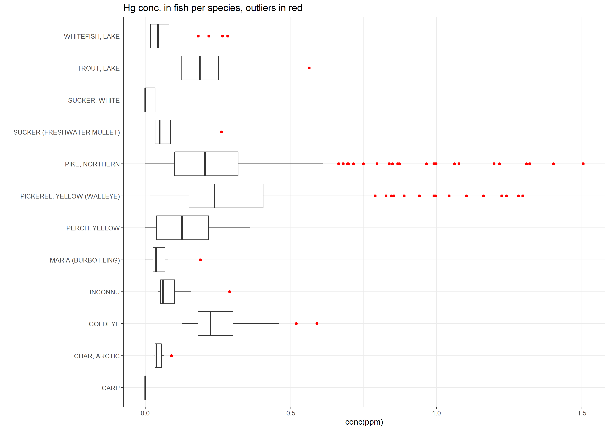
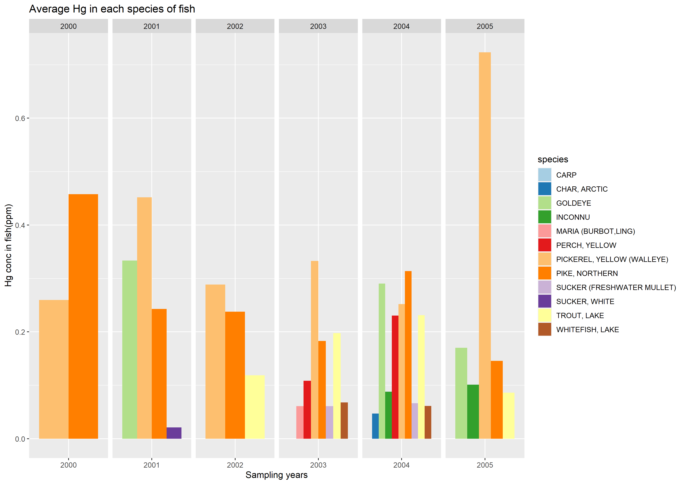

# Mercury in fish
Mercury in fish is an important public health topic. Consumers are exposed to mercury by eating fish that is contaminated with this pollutant. This data on the Government of Canada open data portal for fish sampled between 2000 and 2005. 

This plot looks at fish concentrations for each species of fish collected over that time period. The Yellow Pickerel(walleye) and the Northern Pike have much larger variations in concentrations than all the other species of fish sampled.

I was curious to see what the data would look like for each sampling year. Unfortunately for the earlier years, only 2 species are represented. Still the same two species stand out. In fact Canadian fish consumption guidelines note that Northern pike and Walleye have higher levels of mercury because these fish feed on other fish. Mercury tends to be higher in fish that consume other fish, concentrations tend to increase the higher an organism is on the food chain. 

