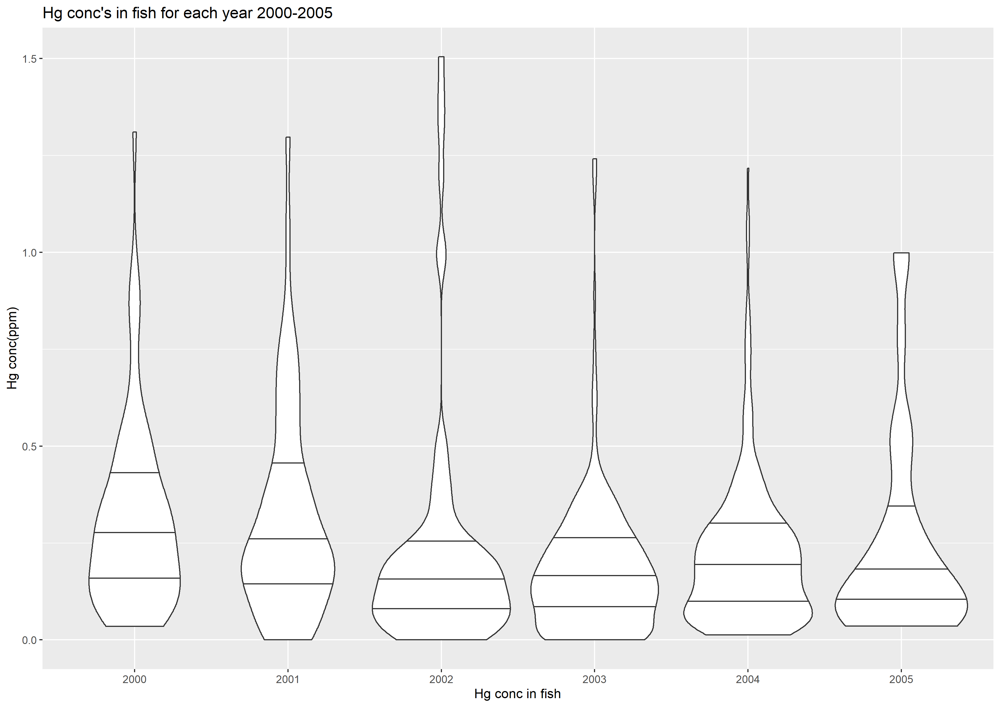

# Mercury in fish
Mercury in fish is an important public health topic. Consumers are exposed to mercury by eating fish that is contaminated with this pollutant. I found this data on the Government of Canada open data portal. 

